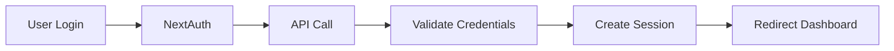

<div align="center">

# 📁 SIADIL - Sistem Arsip Digital

**Modern Document Management System**

[](https://nextjs.org/)
[](https://www.typescriptlang.org/)
[](https://tailwindcss.com/)
[](https://next-auth.js.org/)

</div>

---

## 📋 Table of Contents

- [✨ Features](#-features)
- [🚀 Quick Start](#-quick-start)
- [🔐 Authentication](#-authentication)
- [📚 Documentation](#-documentation)
- [🛠️ Tech Stack](#️-tech-stack)
- [📁 Project Structure](#-project-structure)
- [🔧 Development](#-development)
- [🚀 Deployment](#-deployment)
- [🤝 Contributing](#-contributing)

---

## ✨ Features

<div align="center">

| Feature | Description | Status |
|---------|-------------|--------|
| 🔐 **Authentication** | NextAuth.js + API SSO Integration | ✅ Ready |
| 📊 **Dashboard** | Modern responsive dashboard | ✅ Ready |
| 📄 **Document Management** | Full CRUD operations | ✅ Ready |
| 👥 **User Profiles** | Dynamic profiles with photos | ✅ Ready |
| 🔒 **Protected Routes** | Middleware-based protection | ✅ Ready |
| 🎨 **Modern UI** | Tailwind CSS + Radix UI | ✅ Ready |
| 📱 **Responsive Design** | Mobile-first approach | ✅ Ready |

</div>

### 🎯 Core Capabilities

- **🔑 Single Sign-On (SSO)** - Seamless integration with Pupuk Kujang API
- **📱 Progressive Web App** - Modern web technologies
- **⚡ Real-time Updates** - Live data synchronization
- **🛡️ Enterprise Security** - Role-based access control
- **📊 Analytics Dashboard** - Document insights and reports
- **🔍 Advanced Search** - Full-text search capabilities
- **📎 File Management** - Upload, organize, and share documents

---

## 🚀 Quick Start

### Prerequisites

- **Node.js** 18+ 
- **npm** or **yarn**
- **Git**

### 1️⃣ Clone Repository

```bash
git clone https://github.com/Arkana-dk/web-siadil-new.git
cd web-siadil-new
```

### 2️⃣ Install Dependencies

```bash
npm install
```

### 3️⃣ Environment Setup

Create `.env.local` file in root directory:

```env
# Application
NEXTAUTH_URL=http://localhost:3001
NEXTAUTH_SECRET=your-super-secret-key-min-32-characters

# API Configuration  
NEXT_PUBLIC_API_URL=https://api.pupuk-kujang.co.id/demplon
NEXT_PUBLIC_USE_MOCK_AUTH=true

# Optional
NODE_ENV=development
```

> 💡 **Tip:** Set `NEXT_PUBLIC_USE_MOCK_AUTH=false` for production

### 4️⃣ Run Development Server

```bash
npm run dev
```

🎉 **Open [http://localhost:3001](http://localhost:3001) in your browser**

### 5️⃣ Login

**Development Mode:**
- **Admin:** `admin` / `admin123`
- **User:** `user` / `user123`

**Production Mode:**
- Use your Pupuk Kujang credentials

---

## 🔐 Authentication

SIADIL uses **NextAuth.js v4** with custom credentials provider for seamless SSO integration.

### Authentication Flow



### Session Management

- **Strategy:** JWT-based sessions
- **Duration:** 30 days (configurable)
- **Security:** httpOnly cookies + CSRF protection
- **Access Token:** Automatically stored and refreshed

---

## 📚 Documentation

| Document | Description | Updated |
|----------|-------------|---------|
| **[AUTH_README.md](./AUTH_README.md)** | Complete authentication guide + login tutorial | ✅ Latest |
| **[ACCESS_TOKEN_GUIDE.md](./ACCESS_TOKEN_GUIDE.md)** | API integration + practical examples | ✅ Latest |
| **[API_INTEGRATION.md](./API_INTEGRATION.md)** | Backend API integration details | ✅ |
| **[QUICK_SETUP.md](./QUICK_SETUP.md)** | Step-by-step setup guide | ✅ |
| **[TROUBLESHOOTING.md](./TROUBLESHOOTING.md)** | Common issues & solutions | ✅ |

### Development Guides

- **[API_TEST.md](./API_TEST.md)** - API testing with examples
- **[CURRENT_STATUS.md](./CURRENT_STATUS.md)** - Project status tracking
- **[VPN_USAGE_GUIDE.md](./VPN_USAGE_GUIDE.md)** - Network configuration

---

## 🛠️ Tech Stack

### Core Technologies

<div align="center">

| Category | Technology | Version | Purpose |
|----------|------------|---------|---------|
| **Framework** | Next.js | 15.5.2 | React framework with App Router |
| **Language** | TypeScript | ^5.0 | Type-safe development |
| **Styling** | Tailwind CSS | ^3.4.17 | Utility-first CSS framework |
| **Auth** | NextAuth.js | ^4.24.11 | Authentication & session management |

</div>

### UI & Components

- **Radix UI** - Accessible component primitives
- **Lucide React** - Beautiful icon library
- **Sonner** - Toast notifications
- **React Hook Form** - Form handling

### Development

- **ESLint** - Code linting
- **Prettier** - Code formatting
- **Husky** - Git hooks
- **TypeScript** - Static type checking

---

## 📁 Project Structure

```
src/
├── app/                          # Next.js App Router
│   ├── api/auth/[...nextauth]/  # Authentication API
│   ├── login/                   # Login page
│   ├── dashboard/               # Protected dashboard
│   │   ├── siadil/             # Main SIADIL app
│   │   ├── profile/            # User profile
│   │   ├── e-prosedure/        # E-procedure module
│   │   ├── employe-directory/  # Employee directory
│   │   └── ...                 # Other modules
│   ├── layout.tsx              # Root layout
│   └── page.tsx                # Landing page
├── components/                  # Reusable components
│   ├── ProfileSection.tsx      # User profile widget
│   ├── Sidebar.tsx             # Navigation sidebar
│   ├── Providers.tsx           # Context providers
│   └── ui/                     # UI components
├── lib/                        # Utilities & configurations
│   ├── auth.ts                 # NextAuth configuration
│   ├── api.ts                  # API utility functions
│   └── utils.ts                # Helper functions
├── types/                      # TypeScript definitions
│   └── next-auth.d.ts          # NextAuth types
└── middleware.ts               # Route protection
```

---

## � Development

### Available Scripts

```bash
# Development
npm run dev          # Start development server
npm run build        # Build for production
npm run start        # Start production server
npm run lint         # Run ESLint

# Utils
npm run clean        # Clean build cache
npm run type-check   # TypeScript checking
```

### Development Workflow

1. **Branch from main-new**
2. **Make changes**
3. **Test thoroughly**
4. **Submit pull request**

### Code Quality

- **ESLint** configuration for consistent code style
- **TypeScript** for type safety
- **Prettier** for code formatting
- **Husky** for pre-commit hooks

---

## 🚀 Deployment

### Production Checklist

- [ ] Set `NEXT_PUBLIC_USE_MOCK_AUTH=false`
- [ ] Configure production `NEXTAUTH_URL`
- [ ] Generate secure `NEXTAUTH_SECRET`
- [ ] Verify API endpoints accessibility
- [ ] Test authentication flow
- [ ] Enable HTTPS

### Deployment Platforms

#### Vercel (Recommended)

```bash
npm i -g vercel
vercel
```

#### Docker

```dockerfile
FROM node:18-alpine
WORKDIR /app
COPY package*.json ./
RUN npm ci --only=production
COPY . .
RUN npm run build
EXPOSE 3000
CMD ["npm", "start"]
```

#### Other Platforms

- **Railway** - `railway deploy`
- **Netlify** - Connect repository
- **AWS/GCP** - Use Docker image

---

## 🤝 Contributing

We welcome contributions! Please see our contributing guidelines.

### Development Setup

1. Fork the repository
2. Clone your fork
3. Create feature branch: `git checkout -b feature/amazing-feature`
4. Make changes and test
5. Commit: `git commit -m 'Add amazing feature'`
6. Push: `git push origin feature/amazing-feature`
7. Submit pull request

### Code Style

- Follow TypeScript best practices
- Use meaningful commit messages
- Add tests for new features
- Update documentation

---

## 📄 License

This project is proprietary software for **PT Pupuk Kujang (Demplon)** internal use.

---

## 👥 Team

<div align="center">

**Developed with ❤️ by Demplon IT Team**

[](https://github.com/Arkana-dk)

---

**Version:** 1.0.0 | **Last Updated:** October 2025 | **Status:** ✅ Production Ready

</div>
